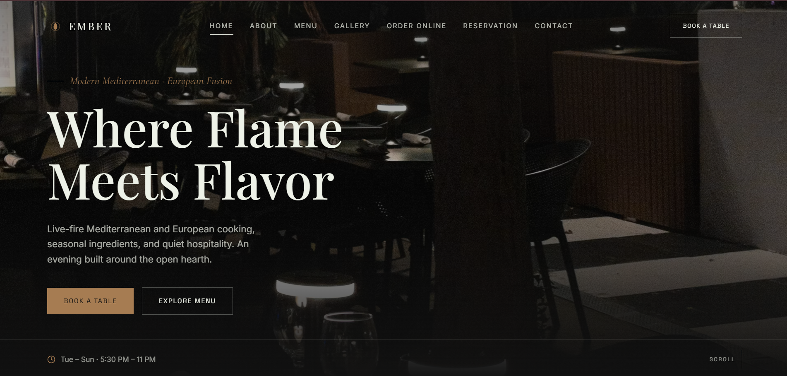
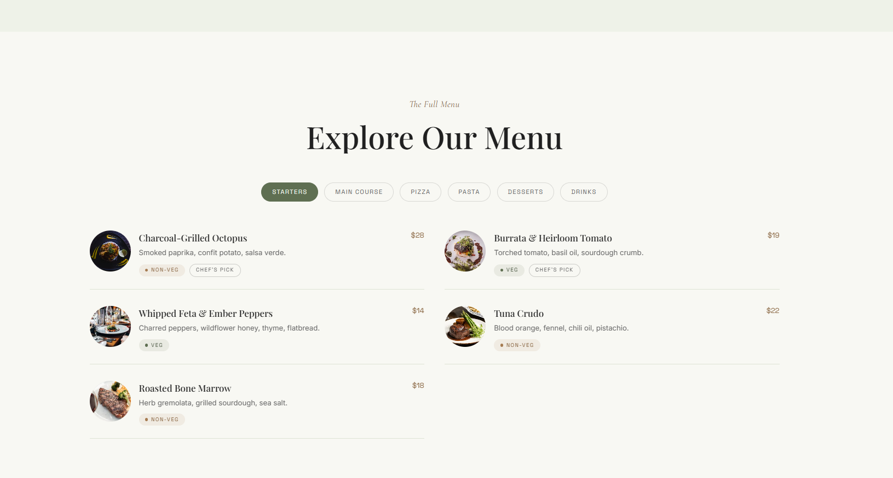
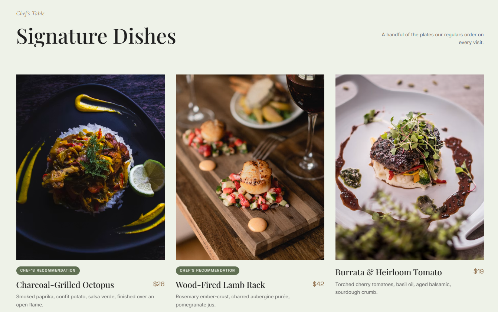
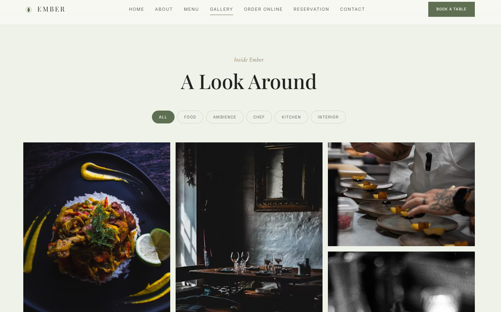
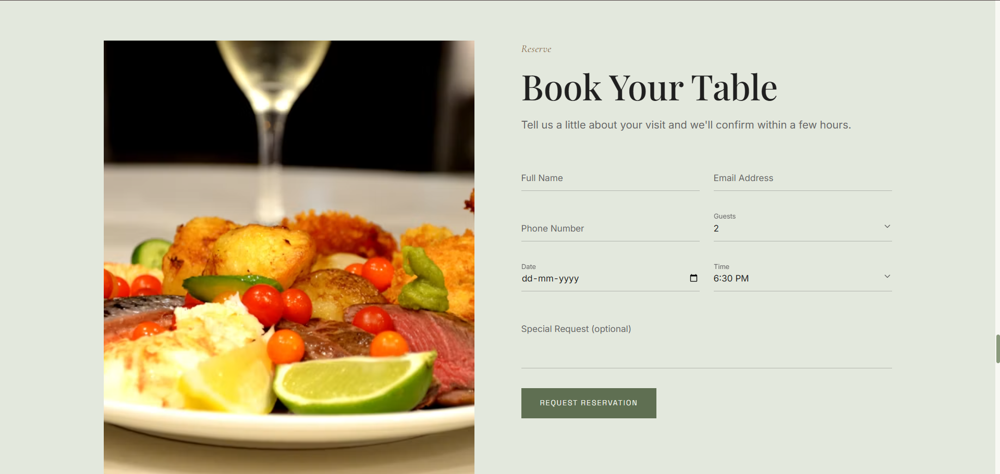
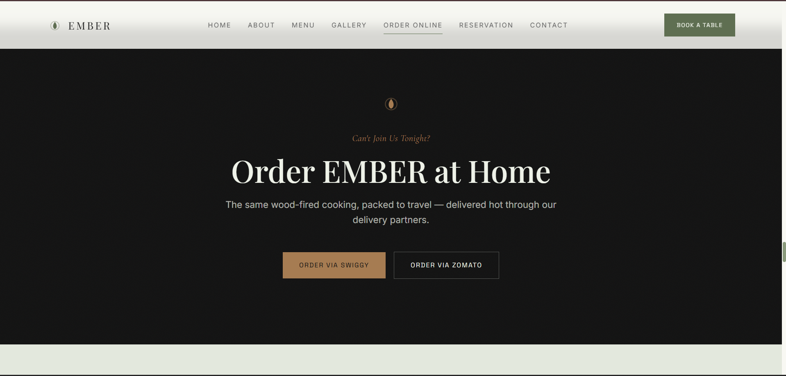

# EMBER — Modern Restaurant Website

A modern, responsive restaurant website developed as **Task 1 of the Pinnacle Labs Web Development Internship 2026**.

EMBER is designed around a simple principle: a restaurant website should be visually appealing while making important customer actions quick and easy. Visitors can explore the menu, view dishes, order online, book a table, check restaurant information, and get in touch without unnecessary interaction barriers.

---

## ✨ Overview

EMBER combines a clean editorial visual style with practical restaurant functionality.

The website focuses on:

- Restaurant information
- Menu and signature dishes
- Online ordering
- Table reservations
- Food and restaurant gallery
- Customer testimonials
- Contact information
- Responsive design
- Smooth scroll interactions

The design combines a dark hero section with soft sage-green and warm neutral sections for a clean and refined visual identity.

---

## 🚀 Main Sections

| Section | Description |
|---|---|
| **Home** | Restaurant introduction and primary actions |
| **About Us** | Restaurant story and philosophy |
| **Why Choose Us** | Key restaurant highlights |
| **Signature Dishes** | Featured dishes and food presentation |
| **Menu** | Food categories, dishes, descriptions, and pricing |
| **Gallery** | Food, restaurant, and ambience photography |
| **Order Online** | Online ordering options |
| **Reservation** | Table booking interface |
| **Testimonials** | Customer reviews and ratings |
| **Contact Us** | Location, contact details, and opening hours |

---

## 📸 Website Preview

### Home

### Menu

### Signature Dishes

### Gallery

### Reservation

### Order Online

> Screenshots are stored in the [`screenshots`](./screenshots) directory.

---

## 🎨 Design

### Color Palette

| Role | Color |
|---|---|
| Hero Background | `#111111` |
| Primary Background | `#EEF2E8` |
| Alternate Background | `#F8F8F3` |
| Card Surface | `#E3E8DD` |
| Primary Accent | `#5F6F52` |
| Secondary Accent | `#A67C52` |
| Primary Text | `#202020` |
| Secondary Text | `#666666` |

The visual direction combines dark and soft neutral tones to create a modern restaurant aesthetic while keeping the interface easy to navigate.

---

## 🛠️ Tech Stack

- **React**
- **TypeScript**
- **Vite**
- **Tailwind CSS**
- **GSAP**
- **GSAP ScrollTrigger**
- **Lenis**
- **React Icons**

> Only technologies actually used in the project are listed above.

---

## 📌 Internship

Program: Pinnacle Labs Web Development Internship 2026
Task: Task 1 — Restaurant Website
Project: EMBER

## 👩‍💻 Author

Srijita Biswas

Computer Science Engineering Undergraduate

## 📄 License

Developed for educational and portfolio purposes as part of the Pinnacle Labs Web Development Internship 2026.
